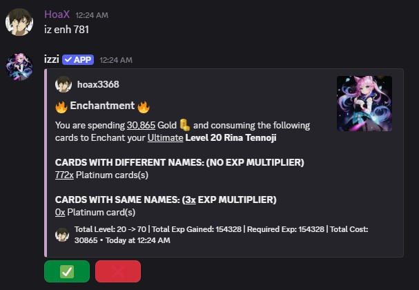
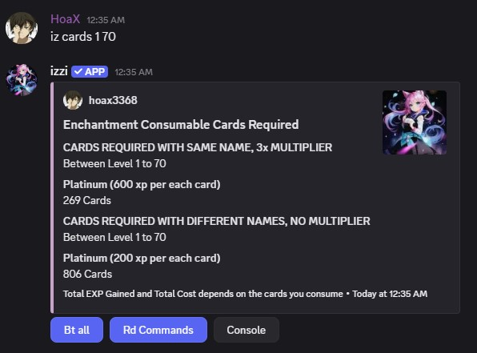

## Usage
- command: `iz enh <card row number> <filters>`
- alias: `enh, enchant, enchantment`

<Note>For more details use `iz help enh`.</Note>

<Note>Silver, Gold and Platinum cards are considered fodders.</Note>
- Enchant your card using `iz enh <row number>`
- You can specify the name of the fodders to consume using `iz enh 781 -n akane`.

## How much XP do Fodders give?
- You get 200xp per fodder. However, if cards with same name are consumed you get 600xp per fodder.
<Note>Cards with same name refers to the same character name. Ex: **Ultimate Rina Tennoji** consumes **Platinum Rina Tennoji** cards 
to gain 3x Exp.</Note>

## How many Cards are Required for Max Level?
- The number of cards needed to enchant a card varies based on your current card level.
- Use `iz cards <current level> <max level>` to see the number of cards required to reach your desired level.

<CardGroup cols="3">
<Card title="Fodders" href="/general/fodders" horizontal icon="thumbtack" />
</CardGroup>
