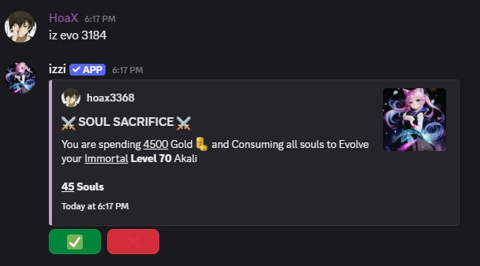
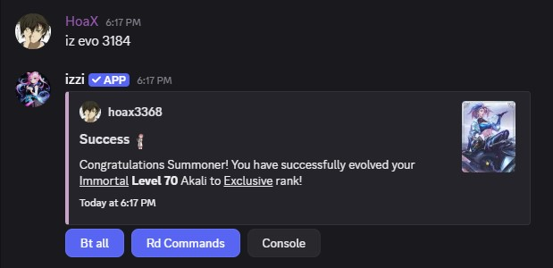
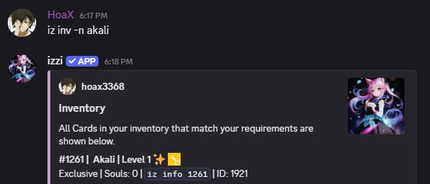
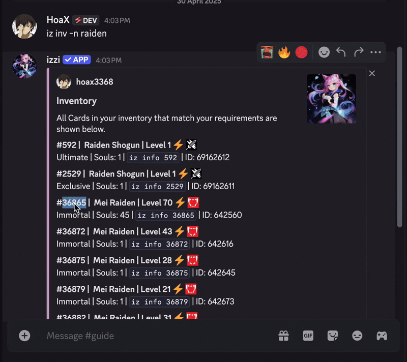

- The rarity hierarchy is as follows: **Legend** -> **Divine** -> **Immortal** -> **Exclusive** -> **Ultimate** -> **Mythical**.
- You can evolve your card from **Legend** all the way to **Mythical**.

## How to Evolve a Card
- Souls are required to evolve your card to max rarity.
- Checkout [souls](/advanced/souls) to see how you can get them.

## Usage
- command: `iz evo <card ID>`

<CardGroup cols="3">
<Card title="Sacrifice" horizontal href="sacrifice" icon="thumbtack" />
<Card title="Souls" horizontal href="souls" icon="thumbtack" />
</CardGroup>
