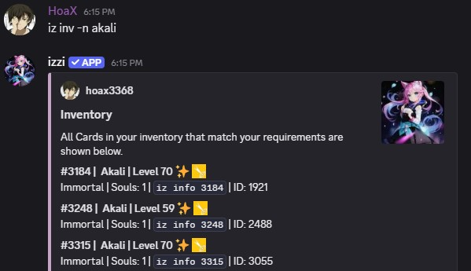
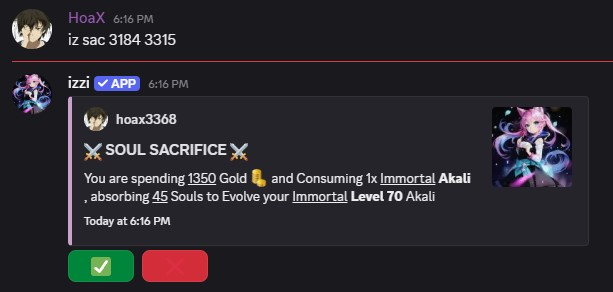
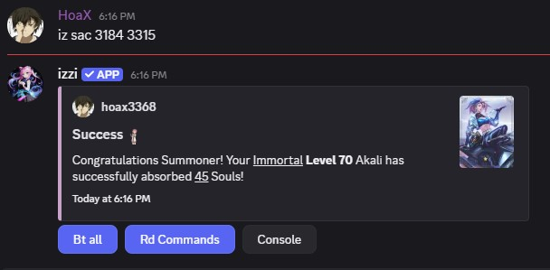
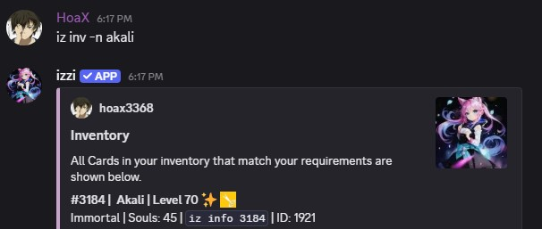

- `card ID1` and `card ID2` refers to the row numbers in your invnetory.
- `card ID1` consumes `card ID2` to gain the souls required to evolve into its next rarity.

## Usage
- command: `iz sac <card ID1> <card ID2>`

<Note>It requires 1 copy of the same card and both cards have to be Max Level.</Note>

- Card `3184` consumes `3315` to gain 45 souls.

