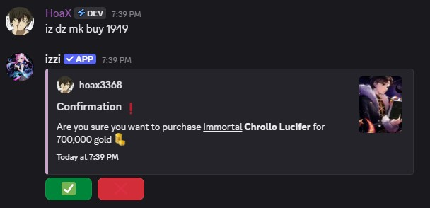

- To list all cards on the Dark Zone Market use `iz dz mk <filters>`. 
- You can filter market by series using `iz dz mk -s genshin`.

## Buying a card
### Usage
- command: `iz dz mk buy <ID>`

## Selling a card
### Usage
- command: `iz dz mk sell <ID> <price>`.

## Remove card from market
### Usage
- command: `iz dz mk remove <ID>`.
