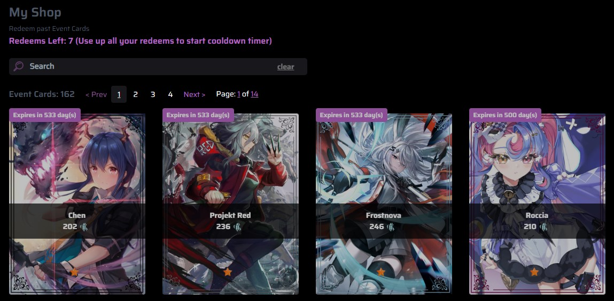

## How to Redeem Event Cards?
- Redeem event cards at https://izzi-xenex.xyz/events using shards during an on-going event.
- You can redeem **Diamond**, **Immortal**, **Exclusive** rarity event cards.
<Note>The shard cost increases as the rarity of the card increases.</Note>

## Usage
- command `iz ev redeem`

<Note>When an event ends the event cards are no longer redeemable and is considered to be a **Past Event Card**.</Note>

## How to Redeem Past Event Cards?
- Past event cards can be redeemed at [Your Premium Shop](https://izzi-xenex.xyz/@me/shop).
- You must be a [Premium](https://izzi-xenex.xyz/premiums) user to be able to access the shop.
<Note>The shard cost of Past Event Cards is increased.</Note>

### What is "Redeems Left"?
- You get to redeem 7 past event cards per week. The cooldown timer only starts after you have fully exhausted your redeems.
<Note>Your redeems are not carried over to the next week. For example: 
If you have 3 redeems left in week 1 you will not receive additional 4 redeems in week 2.</Note>
<Note>Your redeems are replenished after you have used all redeems and the cooldown timer has ended.</Note>

### How to Redeem Expired Event Cards?
- These card can be redeemed at [Your Premium Shop](https://izzi-xenex.xyz/@me/shop).
- The cost of expired cards is also increased.
- After the cards expires, the label shows the date they were added on.
