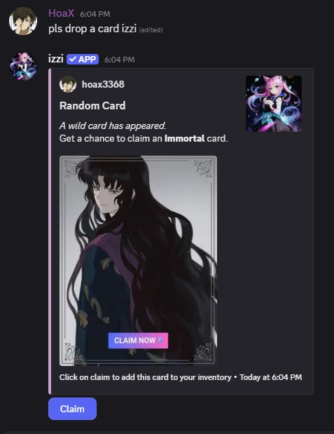

- Card drops are random cards that are dropped in message channels based on your server activity.
- These drops can contain Platinum [75%], Diamond [24.9%] and Immortal [.1%] rarity.

<Note>Cards are not dropped while using izzi commands.</Note>

<Note>If the card is not claimed within 10 minutes, it auto expires.</Note>
<CardGroup cols="3">
<Card href="elements-and-rarity" title="Rarity" icon="thumbtack" horizontal  />
<Card href="inventory" title="Inventory" icon="thumbtack" horizontal  />
</CardGroup>