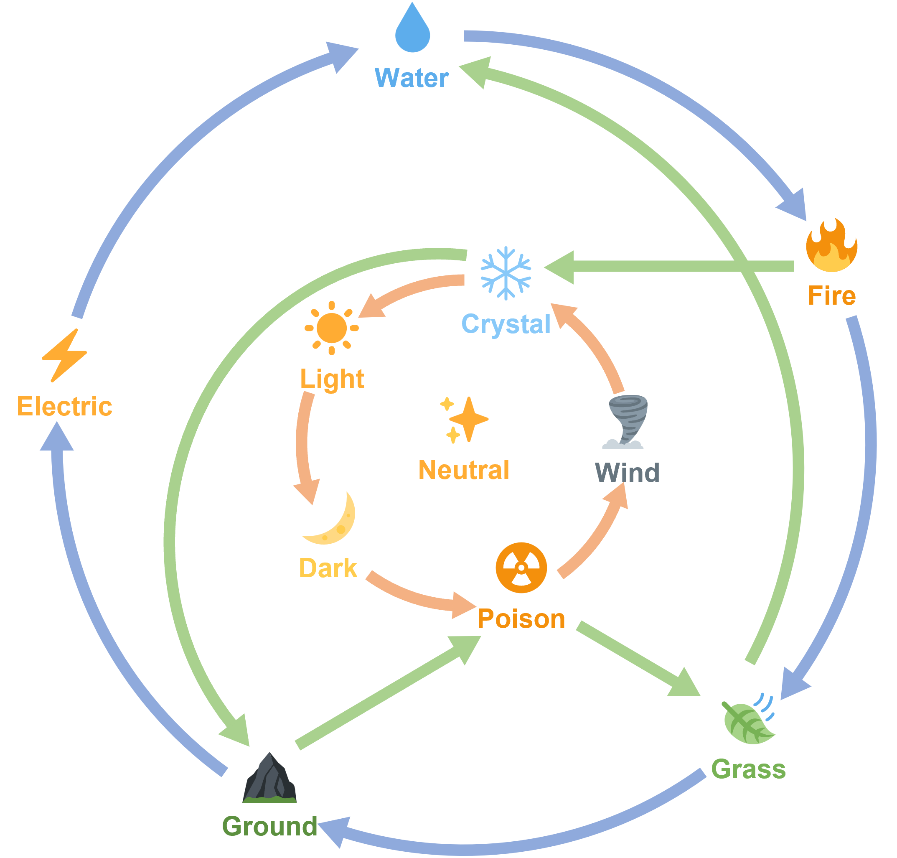

- Using different elemental combinations and higher rarity cards will help you deal more damange to enemy bosses.
- There are 10 rarities `silver`, `gold`, `platinum`, `diamond`, `legend`, `divine`, `immortal`, `exclusive`, `ultimate` and `mythical`.
- Higher the rarity the more powerful the card gets.
<Note>Rarity is also know an 'Ranks'.</Note>
- Similarly, there are 11 elements `💧 water`, `🔥 fire`, `🍃 grass`, `⛰️ground`, `⚡ electric`, `❄ crystal`, `☢️ poison`,
`🌪 wind`, `🌙 dark`, `☀ light` and `✨ neutral`.

## What is Elemental Advantage?
- Having an elemental advantage over the enemy or opponent allows you to deal up to 3x more damage.
- See all elements that are effective against:

<Note>Elemental advantage is denoted by **Slightly Effective 1x**, **Effective 2x** and **Super Effective 3x**.</Note>

## What is the Max Level of a Rarity / Rank?
- Cards can be leveled up to a max level based on their rarity. (The stars represent the ranks).
    - 
  Silver - 50

    - 
   Gold - 50

    - 
    Platinum - 50

    - 
  Diamond - 60

    - 
   Legend - 60

    - 
    Divine - 60

    - 
  Immortal - 70

    - 
   Exclusive - 70

    - 
    Ultimate - 70 (Bonus level up to 80)

    - 
     Mythical - 70 (Bonus level up to 80)

<Note>**Ultimate** and **Mythical** rarity cards can go beyond their max level when special conditions are met.</Note>