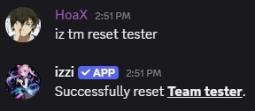

- Items are equipped on positions similar to cards.

<Note>The same item can be equippped on multiple Teams.</Note>

## Usage
`ID` refers to the item ID in your item inventory.
- command: `iz tm equip <ID> <team name>`
<Note>If an item is already equipped on a card, it will be ignored. Items equipped on 
teams take priority during battle.</Note>

## How to Unequip Item
- There is no direct way to unequip an item from a Team. You will just have to reset the team which clears both
assigned cards and items. 

### Usage
- command: `iz tm reset <team name>` 

<CardGroup cols="3">
<Card title="Items" href="/general/items" horizontal icon="thumbtack" />
</CardGroup>
