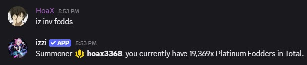
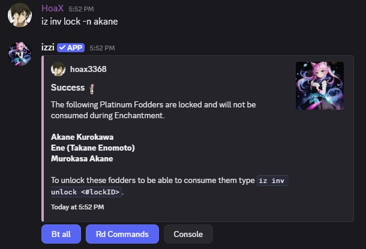
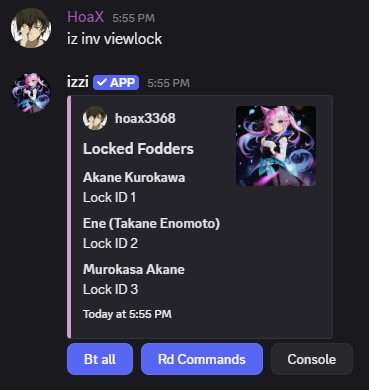
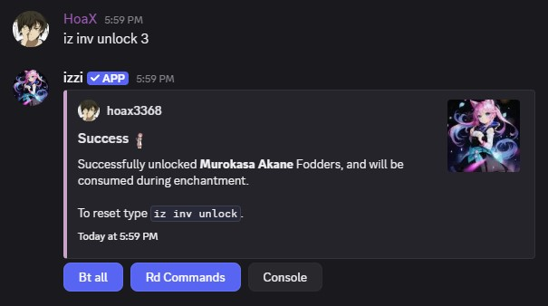

<Note>Silver, Gold and Platinum Rarity cards are considered as Fodders.</Note>
## How to Get
- Raids
- Floors
- Trading
- [Guild Shop](/guilds/shop)

## Used In
- Enchantment

## How to see Fodders?
- All Silver, Gold and Platinum cards are considered as Fodders. Use `iz inv fodds` to view the total fodders you hold. 

## Avoid Consuming Specific Fodds (Locking Fodds)
- This helps avoid consuming specific fodds during **enchantment**.
### Usage
- command: `iz inv lock -n <name>` 

## Viewing Locked Fodds
### Usage
- command: `iz inv viewlock` 

## Unlocking Fodds
- Unlock fodds to be used in **enchantment** again.

### Usage
- command: `iz inv unlock <lock ID>` 

<CardGroup cols="3">
<Card title="Enchantment" href="/advanced/enchantment" horizontal icon="thumbtack" />
</CardGroup>
