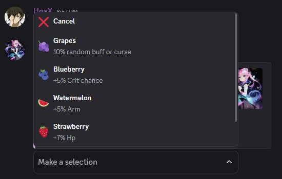
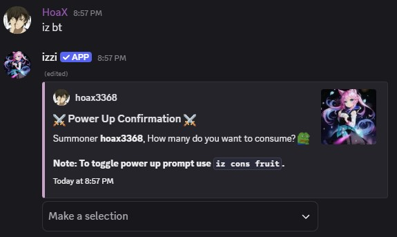

Fruits give bonus power ups. They can be used in Raid, Event, World Boss, Dungeon, Floor and Dark Zone Battles.

## How to Get
- Dark Zone

## Used In
- Floor, Dungeon, Raid, Event, Dark Zone, World Boss Battles

## How to use fruits?
- Use battle commands like `iz bt`, `iz dg`, `iz dz bt`, `iz rd bt` or `iz ev bt` to invoke a prompt.
- They are automatically consumed when the battle starts.  

## How to Enable/Disable Fruit Prompt
- Use `iz cons fruit`.

## Types of Fruits
- Strawberry 🍓 gives +7% Hp.
- Pineapple 🍍 gives +5% Atk.
- Apple 🍎 gives +5% Def.
- Watermelon 🍉 gives +5% Arm.
- Banana 🍌 gives 5% Spd.
- Blueberry 🫐 gives 5% Crit chance.
- Grapes 🍇 gives 10% random stat buff or curse.

<Note>You can consume only one fruit per battle, which grants up to a 5x stat boost based on the amount you choose to consume (1 – 5). 
The boost lasts only for the duration of that battle.</Note>
