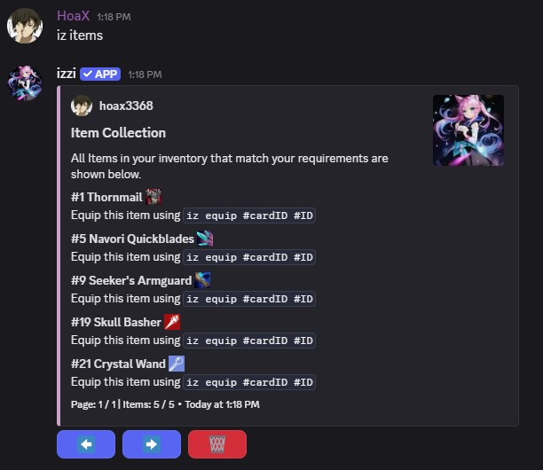
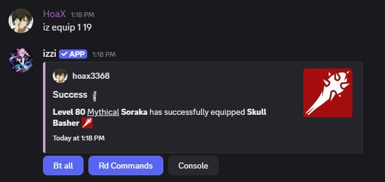

## Usage
- command: `iz items` 

## How to Equip Item
- Use `iz equip <card ID> <ID>` to equip an item on any card you like. `card ID` refers to the card `row number` in your inventory and `ID`
refers to the row number in your item inventory. 
<Note>If an item is already equipped on the same card, it will automatically be replaced by the new item.</Note> 
<Warning>If the item is equipped on a different card, it will be automatically removed from that card.
The same item cannot be equipped on multiple cards at the same time.</Warning>

### Usage
- command: `iz equip <card ID> <ID>`

## How to Unequip Item
- Remove an item from a card using `iz unequip <card ID>` where `card ID` refers to the card `row number`.

### Usage
- command: `iz unequip <card ID>` 
