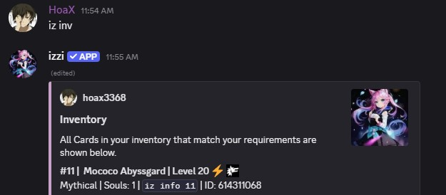
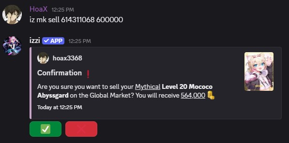
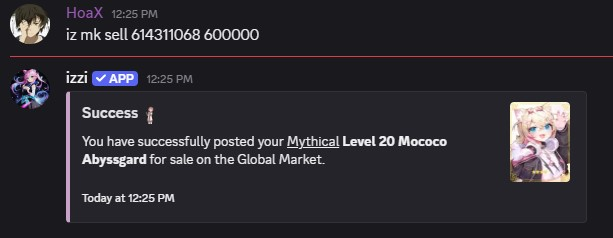
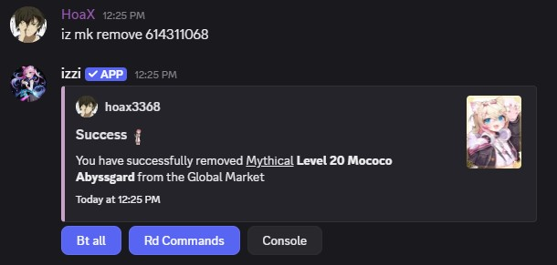
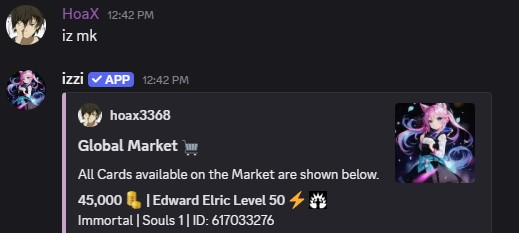
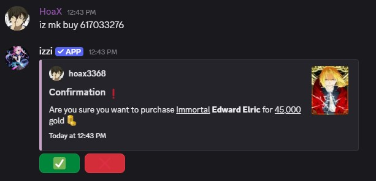
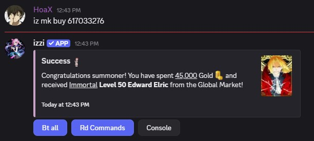

## Usage
- command: `iz mk <filters>`
- alias: `mk, market`

## Market Selling
---
- To make a listing on the Global Market use `iz mk sell <ID> <amount>`. The `ID` refers to the ID of the card you want to sell, and the
`amount` refers to price you want to sell it for.

<Note>Setting `amount` to a reasonable price based on the current market conditions is considered a good practice.</Note>
<Note>A 6% tax is collected when a card is sold on the Global Market. Therefore, if you sell a card for 
<u>600,000</u> gold you receive <u>564,000</u> gold after taxes.</Note>

### Usage
- command: `iz mk sell <id> <amount>`
- example: `iz mk sell 614311068 600000` 

 
 

<Warning>Setting `amount` to be a really high unreasonable price is considered trolling, you will be warned.</Warning>

## Market Unlisting
---
- To unlist a card from the Global Market use `iz mk remove <ID>` where `ID` is the card you have listed on the Global Market.

### Usage
- command: `iz mk remove <id>`
- example: `iz mk remove 614311068` 

## Market Buying
---
- To buy a card from the Global Market use `iz mk buy <ID>` where `ID` is the card you want to purchase.

### Usage
- command: `iz mk buy <id>`
- example: `iz mk buy 617033276`

<CardGroup cols="3">
<Card title="Filters" href="filters#global-market" horizontal icon="thumbtack" />
</CardGroup>
