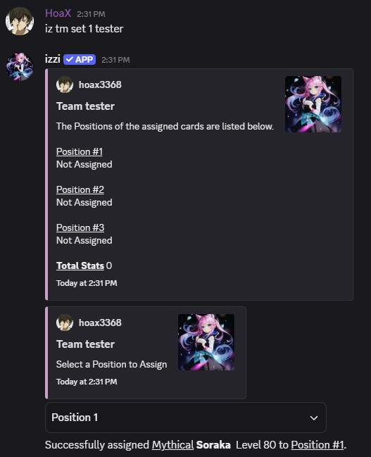

- Use different team comps to deal more damage to high level bosses and opponents.

## Usage
- command: `iz tm`

## Used In
- PvP
- Raids, Events
- World Boss
- Dungeons

## How to Create a Team
- You can create a new team using `iz tm create <name>`. You can create up to a maximum of 5 teams. 

## Assign Cards to a Team
- You can assign up to 3 cards in a team. `card ID` refers to the `card row number` in your inventory.

### Usage
- command: `iz tm set <card ID> <team name>` 

## View your Team
### Usage
- command: `iz tm view <team name>` 

## Selecting a Team for Battle
### Usage
- command: `iz tm select <team name>` 

## Reseting or Removing a Team
- Resetting a team clears out any set cards and items, while Removing a team deletes the team entirely.

### Usage
- command: `iz tm reset <team name>`
- command: `iz tm remove`
 

<CardGroup cols="3">
<Card title="Raids" href="/raids/raids" horizontal icon="thumbtack" />
</CardGroup>
