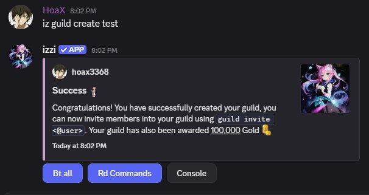
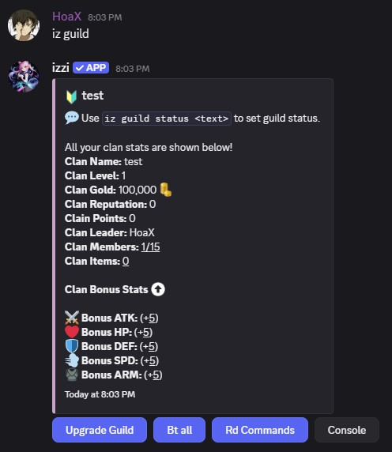
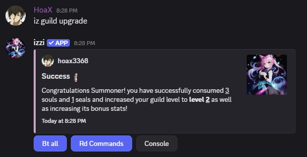
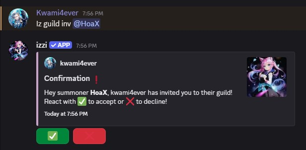
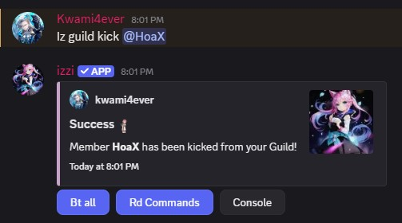
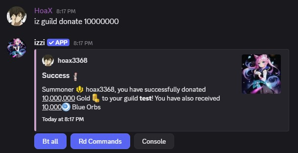

<Tip>For all guild commands see `iz help guild`.</Tip>
<Note>Once you reach Guild level 100 you will be granted access to item stat boosts!</Note>

## Creating a Clan / Guild
- A Guild is closely related to your Discord Server. It costs <u>200,000</u> 
to create a guild.
<Info>100,000 gold will be automatically added to your clan gold.</Info> 

### Usage
- command: `iz guild create <name>`
<Note>You cannot be in more than 1 guild. Only the server owner can create the guild!</Note>

## View Guild
- View your clan stats and more.

### Usage
- command: `iz guild` 

## How to Level Up Guild
- Requires Souls, Seals to upgrade guild and gain bonus stats.

### Usage
- command: `iz guild upgrade` 

## Guild Invite
- Invite your friends to your guild using `iz guild inv @user`.  

## Kicking from Guild
- Only guild admins and owner can kick members from a Guild.

### Usage
- command: `iz guild kick @user` 
<Note>After being kicked from a guild, there is a 24h cooldown before you can join another guild.</Note>

## Leaving a Guild
### Usage
- command: `iz guild leave`
<Note>After you leave a guild, you cannot join another guild for 24h.</Note>

## Guild Donations
- Donating to your guild can be beneficial, such as leveling up your guild and purchase items from the Guild Market.
- Donating to guild also rewards the donator with Orbs .

### Usage
- command: `iz guild donate <amount>` 
