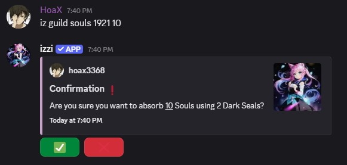
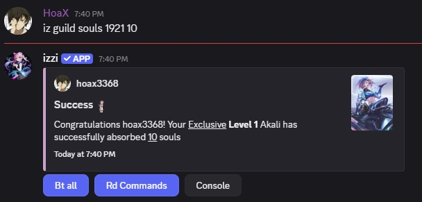

- Guild Souls are used to increase your Guild Level or consume them to increase the rarity of your card.
- card ID refers to the global card ID in your inventory.

<Note>Dark Seal is required to consume Souls. 1 Dark Seal lets you consume up to 5 Souls.</Note>
## Usage
- command: `iz guild souls <card ID> <number of souls>`

<CardGroup cols="3">
<Card title="Evolution" icon="thumbtack" horizontal href="/advanced/evolution" />
<Card title="Guild Upgrade" icon="thumbtack" horizontal href="guilds#how-to-level-up-guild" />
</CardGroup>