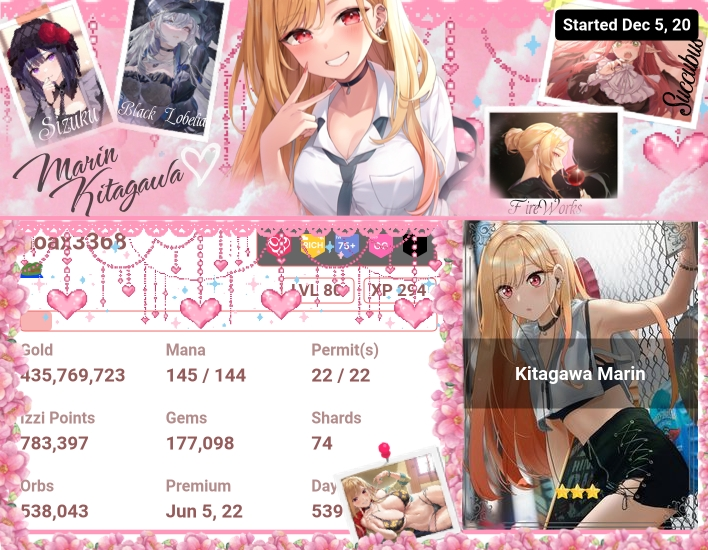
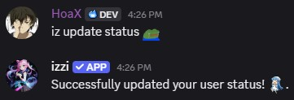
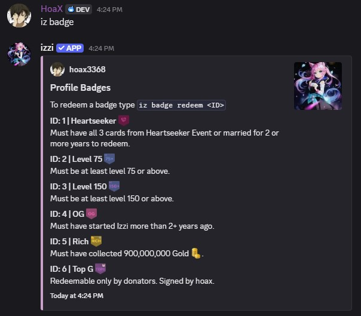
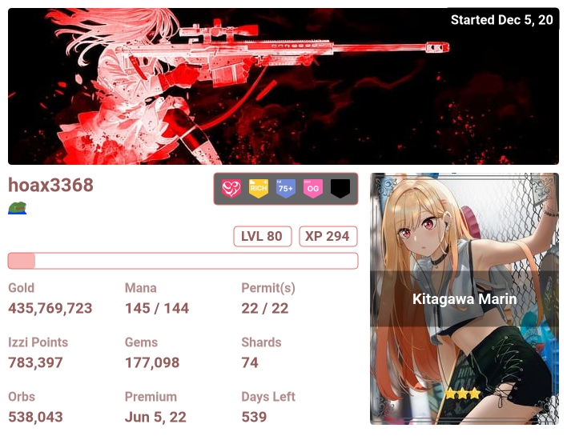

- Profiles are used to showcase your journey in izzi.

## Usage
- command: `iz p <@user>`
<Note>You can also use this command with a User ID without pinging the user. It is also useful when the user is not in the server.
For more information about how to get someone’s User ID, please visit the 
[Official Discord Guide](https://support.discord.com/hc/en-us/articles/206346498-Where-can-I-find-my-User-Server-Message-ID)</Note>

## Profile Config
### Select Card
- Your selected card will appear on your profile by default.
- To select a card type `iz select <#ID>`. <Tip>ID refers to the card ID in your inventory.</Tip>

### User Status
- You can set a profile status using `iz update status <quote>`. 

### Badges
- Collect badges based on your achievements.

#### Usage
- command: `iz badge`.
- redeem a badge with `iz badge redeem 1`. 

## Profile Customization
- Customize text color, offset color and more on this [page](https://izzi-xenex.xyz/@me/customize-profile).
- You can also upload your own banner.

### Profile Banners
- Profile banners are full background banners that can be seen [here](#usage).
- Purchase Profile Banners from [Shop](https://izzi-xenex.xyz/premiums/profile-banners).
- After purchasing your favorite banner head over to [Customize Profile](https://izzi-xenex.xyz/@me/customize-profile) to select.