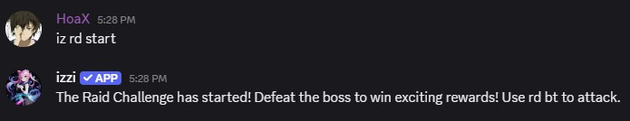
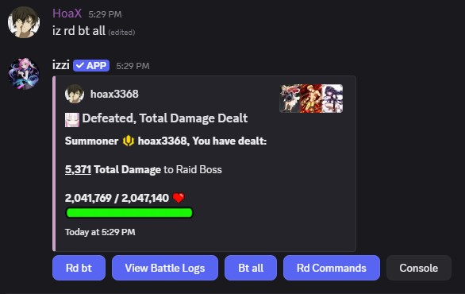
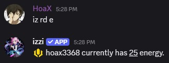

- To fast forward a battle use `hidebt`. Ex: `iz rd bt hidebt`, `iz rd bt all hidebt`. 
## Starting a Raid
- Once all your party members are ready to take on the raid challenge, the raid leader must start the raid.

### Usage
- command: `iz rd start`
<Note>Starting a raid consumes 2 raid permits.</Note> 

## Battle and Energy
- Once your raid has started, to battle the raid boss type `iz rd bt`.
- Energy is similar to mana. You start off with 25 energy and consume 10 energy per raid battle.
- However, should you choose to use all your energy type `iz rd bt all`.

### Usage
- command: `iz rd bt all` 
- command: `iz rd e` 
<Note>The energy regenrates at a rate of 5 energy per 4 minutes.</Note>

<Warning>If your battle gets deleted while in progress it will count as forfeit and will consume the energy and you will deal 0 damage.</Warning>
<Warning>If you change your team while your current battle is in progress, it won't affect in real time until the next time you battle.</Warning>

## Rage Mode
- Once the boss **HP** drops to 0 the first time, the boss will enter **Rage Mode** with slightly buffed stats regaining its
**HP** and **ARMOR**.
<Note>During rage mode the boss will progressively gain <u>10%</u> ATK, <u>25%</u> Critical Hit Damage every round.</Note>

## Raid Damage Capping
- Raid cap means reaching the max damage you can deal per battle. This gets you MVP if you are the highest damage dealer in the lobby.
- The maximum damage you can deal in a raid is capped at 8.5% for solo lobby members and 10% for group party.
<Warning>MVP is not available if you are raiding solo.</Warning>