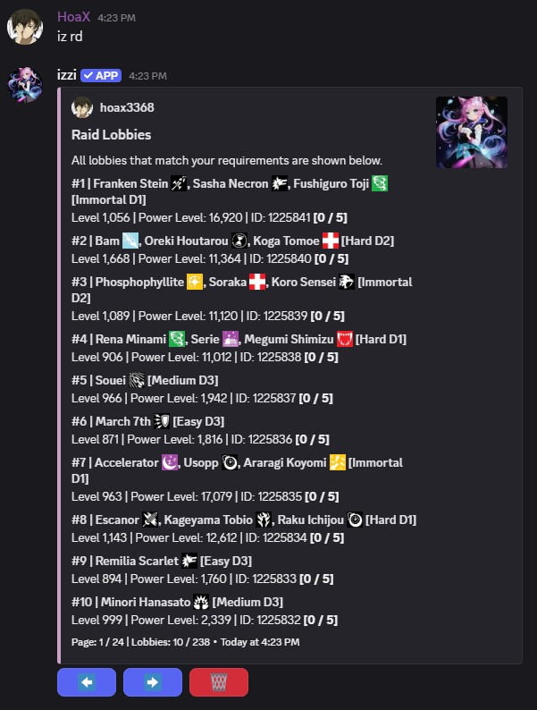
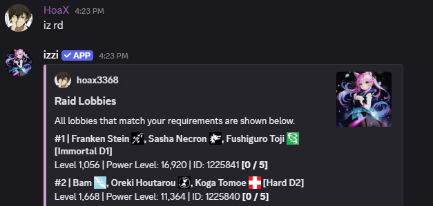
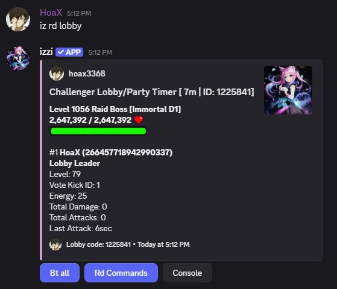

## What are Raids?
- Raid is a co-op PvE aspect of Izzi. Up to 6 players can join a lobby to take down the Raid boss to loot rewards. 
A raid boss is a combination of any cards from any series.
- A raid is a 3v1 or 3v3 mechanic against an enemy boss based on your player level, but each player will use their own team to battle. 
- If you and your party finish a raid you will be rewarded with gold, fodders and more loot.

### Usage
- command: `iz rd` 

## How to Spawn Raid
---
- To spawn a raid use `iz rd spawn <difficulty>`. Difficulty includes `e easy`, `m medium`, `h hard`, `i immortal`.
- By default the raids you spawn will appear in public lobby in which any player can join or even snipe the raid you have spawned.
- To avoid getting sniped, spawn a private raid using `iz rd spawn -p <difficulty>`.
<Note>When you spawn a private raid, you will automatically join as the leader.</Note>
<Note>You can spawn a custom level raid used `iz rd spawn -cap <level> <difficulty>`.</Note>

### Usage
- command: `iz rd spawn i -p`

### Difficulty
- It often represents how difficult it is to defeat a raid based on its Rarity and Power Level. 
- Each Raid is categorised into **Easy**, **Medium**, **Hard** and **Immortal** Raids which is further sub categorised into **D1, D2, D3** 
difficulties **D3** being the easiest and **D1** being the hardest raids to do.
<Note>D1, D2, D3 depicts the card rarity. **Silver, Gold, Platinum** rarity are considered D3 tier, 
**Diamond, Legend, Divine** are D2 tier and **Immortal, Exclusive, Ultimate and Mythical** rarity are D1 tier.</Note>
- The Raid difficulty you spawn is based on your player level. When a high level player spawns an easy raid he has higher 
chance of spawning a D1 raid compared to a low level player who has high chance of spawning 
D3 raids and very little chances of spawning D2 or D1 raids.
<Note>You must be level 22 to spawn or join Immortal Raids.</Note>

### Raid Drops / Loot
- Raid rewards are awarded if the Raid boss is defeated within the given time limit after the raid starts.
- Each raid has two types of Loot. Base loot which everyone gets and additional bonus loot which is distributed among the lobby members.

#### Base Loot
- Consists of Fodders and Gold awarded to all participating players.

#### Bonus Loot
- Distributed among all lobby members. Contains bonus gold, higher rarity card drops at a % drop rate 
based on the raid level & Power Level (PL). The number of bonus card drops are as follows:
    - D1 - 9 Divine Cards, 3 Immortal Cards, 3 Mythical Cards max level - 1500
    - D2 - 6 Divine Cards, 3 Immortal Cards, 3 Mythical Cards max level - 1850
    - D3 - 3 Divine Cards, 3 Immortal Cards, 3 Mythical Cards max level - 2500 can go up to 3750
- Each raid difficulty has some chance of spawning one of the 3 categories.
    - Easy - Can spawn D3 raids
    - Medium - Can spawn D3 and D2 raids
    - Hard - Can spawn D3, D2 and D1 raids
    - Immortal - Can spawn D3, D2 and D1 raids
<Note>In order to qualify for Bonus loot a player must deal 10% of Raid Boss's Max HP.</Note>

#### Party / Lobby MVP
- The player who has dealt the most out of all party members is considered as the lobby MVP. 
<Note>Being the party MVP allows you to complete daily quests and gives additional 5% drop chance on Bonus loot.</Note>

## Joining and Leaving raids
---
- When you join or spawn a raid, a timer of 1 hour is given to recruit up to 6 players.

### Joining Public Lobbies
-  To join a raid lobby type `iz rd join <lobby ID>`. Lobby ID can be found at the bottom of the 
raid view embed in your DM, or on public lobbies. 

#### Usage
- command: `iz rd join 23154`

### Joining Private Lobbies
- To join a private lobby you must ask the lobby leader to invite you to their lobby. 
You can invite players using `iz rd inv <@user>`. Only the lobby leader can invite other players into the party.

#### Usage
- command: `iz rd inv @user`

### Leaving your Lobby
- To leave any raid party use `iz rd leave`.
<Note>If the raid has already started and you wish to leave the party you will lose 2 Raid Permits.</Note>

## Kicking, Vote Kicking and AFK Auto-kick
---
- Before the Raid starts the party leader can kick players using `iz rd kick <#vote-kick-id>`
- Once the raid has started you cannot kick a party member without them being away for more than 30mins.
- Players are auto kicked if they AFK for more than 60 minutes.

### Usage
- command: `iz rd vkick <#vote kick ID>`
<Note>60% vote is required to kick a player from the party.</Note> 

<CardGroup cols="3">
<Card title="Filters" href="/general/filters#raid-lobby" horizontal icon="thumbtack" />
</CardGroup>