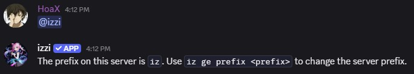

Invite the bot to the server using this [link](https://discord.com/api/oauth2/authorize?client_id=784851074472345633&permissions=277028654144&scope=bot).
- The permissions `SEND_MESSAGES`, `READ_MESSAGE_HISTORY`, `ADD_REACTIONS`, `ATTACH_FILES`, `EMBED_LINKS`, `USE_APPLICATION_COMMANDS` 
are required for the bot to function normally.
- However, giving only `READ_MESSAGE_HISTORY` permission can be good where izzi is not needed while keeping the message activity to drop cards in set channels.
- You can use `iz ge prefix <new prefix>` to change your server prefix. 
- If at any point you forget the server prefix, ping the bot `@izzi` to see your server prefix.

<CardGroup cols="3">
<Card href="general/card-drops" title="Card Drops" icon="thumbtack" horizontal />
</CardGroup>